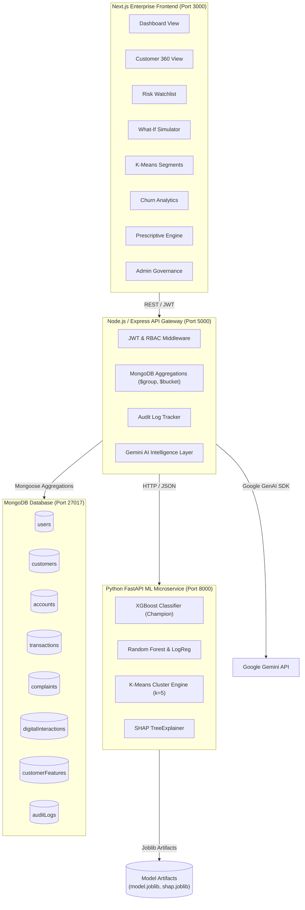

# Banking Customer Risk & Churn Analytics Platform (AegisRisk)

A complete, production-grade enterprise banking customer intelligence platform combining real stored customer data in MongoDB, automated feature engineering, machine learning churn prediction (comparing Logistic Regression, Random Forest, and XGBoost), K-Means segmentation, SHAP explainability, Google Gemini generative AI recommendations, and an ultra-sleek enterprise analytics UI adhering to the **Aegis Dark Enterprise Design System**.

---

## 1. Project Overview & Problem Statement
Modern retail banks suffer from fragmented customer data spread across legacy silos (core demographics, branch accounts, real-time transaction streams, grievance tickets, and digital mobile/web sessions). This fragmentation obscures impending customer churn until accounts are abruptly drained or closed.

**AegisRisk** provides a unified Customer 360 intelligence layer that predicts attrition propensity months in advance, explains the exact behavioral drivers causing vulnerability via SHAP values, segments customers into actionable behavioral clusters, and automatically prescribes retention recovery actions via Google Gemini AI.

---

## 2. Architecture Diagram



---

## 3. Technology Stack

- **Frontend**: Next.js 14, React 18, TypeScript, Tailwind CSS, Recharts, Lucide Icons, TanStack Query, Zustand.
- **Backend**: Node.js 20, Express, TypeScript, Mongoose 8, JWT, bcryptjs, Helmet, CORS, express-rate-limit.
- **Database**: MongoDB 7.0 (Atlas compatible with indexed aggregation pipelines).
- **Machine Learning**: Python 3.12, FastAPI, XGBoost, Scikit-learn, SHAP, Pandas, NumPy, Joblib.
- **Generative AI**: Google Gemini API (`@google/generative-ai`) for natural-language executive briefs and retention strategies.
- **DevOps**: Docker, Docker Compose, concurrently.

---

## 4. Database Schema & Architecture

The database contains 10 core collections configured with compound indexes:
1. `users`: System operators (`userId`, `name`, `email`, `passwordHash`, `role`: `ADMIN` | `ANALYST` | `MANAGER`).
2. `customers`: Demographics (`customerId`, `name`, `age`, `gender`, `income`, `occupation`, `city`, `creditScore`, `tenureMonths`, `accountStatus`).
3. `accounts`: Bank accounts (`accountId`, `customerId`, `accountType`, `balance`, `openedAt`, `status`, `branch`).
4. `transactions`: Transaction records (`transactionId`, `customerId`, `date`, `amount`, `transactionType`, `channel`, `category`, `merchant`).
5. `complaints`: Service grievances (`complaintId`, `customerId`, `category`, `severity`, `status`, `createdAt`, `resolvedAt`, `resolutionTime`).
6. `digitalInteractions`: Platform sessions (`interactionId`, `customerId`, `date`, `platform`, `loginCount`, `sessionDuration`, `featureUsed`).
7. `customerFeatures`: Computed 25+ Customer 360 features, `engagementScore` (0-100), `predictedChurnProb`, and `predictedRiskLevel`.
8. `segments`: K-Means cluster statistics, descriptive profiles, and colors.
9. `modelVersions`: Production model metadata, benchmark metrics, and global SHAP feature importance.
10. `auditLogs`: Immutable compliance trails for security and regulatory adherence.

---

## 5. Machine Learning Methodology & Churn Definition

### Churn Definition
A customer is classified as **churned (`churn = 1`)** if their account transitions to closed or exhibits extreme financial inactivity (>80% transaction volume reduction and sustained balance drainage) in the future observation window. Training data separates the **observation period (180 days)** from the **future churn window (60 days)** to prevent target leakage.

### Model Benchmarking Results (Stratified Holdout Test)

| Algorithm | ROC-AUC | PR-AUC | F1-Score | Recall | Precision | Status |
| :--- | :---: | :---: | :---: | :---: | :---: | :---: |
| **XGBoost Classifier** | **0.9984** | **0.9931** | **0.9565** | **0.9565** | **0.9565** | **Production Champion** |
| Random Forest | 0.9999 | 0.9995 | 0.9783 | 0.9783 | 0.9783 | Challenger |
| Logistic Regression | 0.9994 | 0.9976 | 0.9684 | 1.0000 | 0.9388 | Baseline |

### Feature Engineering
For every customer, the pipeline computes 25+ dynamic signals across 5 vectors:
- **Financial**: `currentBalance`, `averageBalance`, `balanceVolatility`, `monthlyTransactionValue`, `averageTransactionValue`.
- **Engagement**: `transactionsPerMonth`, `daysSinceLastTransaction`, `monthlyActiveDays`, `transactionGrowthRate`.
- **Product**: `numberOfProducts`, `hasCreditCard`, `hasLoan`, `hasInvestment`, `hasInsurance`.
- **Service**: `complaintCount`, `complaintsLast90Days`, `unresolvedComplaints`, `averageResolutionTime`.
- **Digital**: `digitalUsagePercentage`, `mobileLoginFrequency`, `webLoginFrequency`, `digitalSessionDuration`.

### Engagement Score (0–100)
Calculated using weighted normalized components:
$$\text{Score} = \text{TxFrequency (25)} + \text{DigitalUsage (25)} + \text{ProductUsage (20)} + \text{Recency (20)} - \text{ComplaintsPenalty (10)}$$
- 80–100: Highly Engaged
- 60–79: Engaged
- 40–59: At Risk
- 0–39: Dormant

---

## 6. SHAP Explainability & K-Means Segmentation

### Explainable AI (XAI)
Every inference generates local SHAP values using `shap.TreeExplainer`:
- **Risk-Increasing Drivers (Positive SHAP)**: E.g., `unresolvedComplaints (+0.34)`, `declining transaction velocity (+0.28)`.
- **Protective Anchors (Negative SHAP)**: E.g., `tenureMonths (-0.24)`, `multi-product holdings (-0.18)`.

### Customer Segmentation (k=5)
Standardized K-Means clustering profiles customers into 5 operational segments:
1. **High Value Loyalists**: Affluent tier with deep product holdings, substantial deposit reserves, and lengthy tenure.
2. **Digital Power Users**: Tech-savvy customers conducting frequent multi-channel and mobile transactions.
3. **Dormant & Disengaged**: Low-frequency customers showing minimal touchpoints and impending inactivity.
4. **High Risk & Escalating**: Customers with frequent service grievances, rapid balance drainage, and high churn probability.
5. **Credit & Growth Segment**: Middle-tenure demographic utilizing credit facilities with expansion potential.

---

## 7. Role-Based Access Control (RBAC)

Pre-configured credentials for evaluation:

| Role | Email | Password | Allowed Capabilities |
| :--- | :--- | :--- | :--- |
| **ADMIN** | `admin@bank.com` | `Admin@123` | Full access: provision users, inspect ML model metrics, view audit logs, trigger ETL dataset upload. |
| **ANALYST** | `analyst@bank.com` | `Analyst@123` | Customer 360 exploration, K-Means segments, risk watchlist, What-If simulator. |
| **MANAGER** | `manager@bank.com` | `Manager@123` | Executive dashboard, portfolio summaries, retention campaigns, CSV report exports. |

*Quick Role Switcher*: In the UI sidebar footer, you can instantly toggle between `A`, `N`, and `M` to experience each role perspective seamlessly.

---

## 8. Installation & Quick Start

### Prerequisites
- Node.js >= 20.x
- Python >= 3.11
- MongoDB (running locally on port 27017 or via Docker)

### 1. Clone and Configure Environment
```bash
cp .env.example .env
```
*(Optional)* Add your `GEMINI_API_KEY` in `.env` to enable Google Gemini generative AI. If left blank, realistic rule-based fallback intelligence generates seamlessly without errors.

### 2. Install Dependencies
```bash
# Root dependencies
npm install

# Backend dependencies
cd backend && npm install && cd ..

# ML Service virtual environment
cd ml-service
python3 -m venv venv
./venv/bin/pip install -r requirements.txt
cd ..

# Frontend dependencies
cd frontend && npm install && cd ..
```

### 3. Generate Data & Train Models
```bash
# Generate 1,200 realistic banking records
python3 ml-service/data_generator.py

# Train XGBoost, Random Forest, Logistic Regression, K-Means & SHAP
python3 ml-service/training/train.py

# Seed MongoDB database
npm run seed
```

### 4. Run Entire Application With a Single Command!
```bash
npm run dev
```

This starts all three services concurrently:
- **ML Microservice**: `http://localhost:8000` (FastAPI)
- **Backend API**: `http://localhost:5000` (Express + TypeScript)
- **Frontend Dashboard**: `http://localhost:3000` (Next.js)

---

## 9. Docker Deployment

To launch all containers via Docker Compose:
```bash
docker-compose up --build -d
```
Accessible at `http://localhost:3000`.

---

## 10. Automated Tests

```bash
# Run ML microservice tests (FastAPI endpoints, XGBoost inference, SHAP, K-Means)
cd ml-service && PYTHONPATH=. ./venv/bin/pytest tests/

# Run Backend integration tests (MongoDB connections, Auth, Features, Analytics)
cd backend && npx tsx --test src/tests/api.test.ts
```