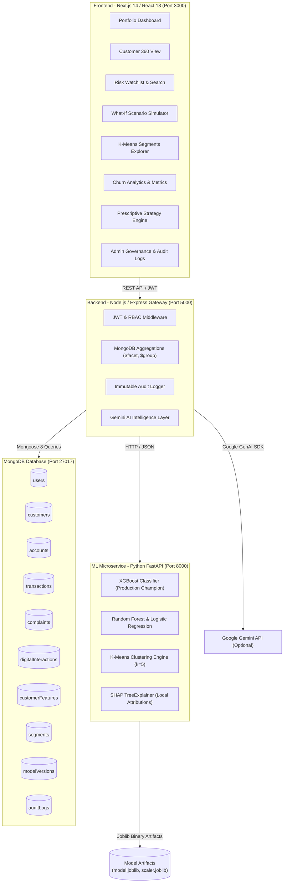

# AegisRisk | Banking Customer Risk & Churn Analytics Platform

[](https://nextjs.org/)
[](https://www.typescriptlang.org/)
[](https://nodejs.org/)
[](https://fastapi.tiangolo.com/)
[](https://www.mongodb.com/)
[](https://xgboost.readthedocs.io/)
[](https://www.docker.com/)

A complete, production-grade enterprise banking customer intelligence platform combining real stored customer records in **MongoDB**, automated 25+ feature engineering, machine learning churn prediction (**XGBoost Champion**, **Random Forest**, **Logistic Regression**), **K-Means segmentation (k=5)**, **SHAP explainability**, **Google Gemini generative AI** retention strategies, and an ultra-sleek enterprise analytics UI built with **Next.js 14** and **Tailwind CSS**.

---

## Table of Contents

1. [Quick Access & Port Overview](#1-quick-access--port-overview)
2. [Default Login Credentials (RBAC)](#2-default-login-credentials-rbac)
3. [How to Open & Run This Project](#3-how-to-open--run-this-project)
   - [Prerequisites](#prerequisites)
   - [Method 1: One-Command Full Stack (Recommended)](#method-1-one-command-full-stack-recommended)
   - [Method 2: Docker Compose (Zero Manual Dependency Setup)](#method-2-docker-compose-zero-manual-dependency-setup)
   - [Method 3: Running Services Individually](#method-3-running-services-individually)
   - [Method 4: Standalone Prototype / Static UI Preview](#method-4-method-4-standalone-prototype--static-ui-preview)
4. [Environment Configuration (.env)](#4-environment-configuration-env)
5. [System Architecture](#5-system-architecture)
6. [Machine Learning Pipeline & Churn Definition](#6-machine-learning-pipeline--churn-definition)
7. [Database Schema & Seed Data](#7-database-schema--seed-data)
8. [Available NPM & Python Scripts](#8-available-npm--python-scripts)
9. [Running Automated Tests](#9-running-automated-tests)
10. [Troubleshooting & FAQs](#10-troubleshooting--faqs)

---

## 1. Quick Access & Port Overview

When all services are running, the application components are available at:

| Service | Technology | URL | Description |
| :--- | :--- | :--- | :--- |
| **Frontend Web App** | Next.js 14, React 18, Tailwind | [`http://localhost:3000`](http://localhost:3000) | Main executive & analyst dashboard |
| **Backend REST API** | Express, TypeScript, Mongoose | [`http://localhost:5000`](http://localhost:5000) | Secure API gateway & aggregations |
| **Backend Health Check** | Express | [`http://localhost:5000/health`](http://localhost:5000/health) | API health & MongoDB status |
| **ML Microservice** | FastAPI, Python 3.12 | [`http://localhost:8000`](http://localhost:8000) | High-speed XGBoost & SHAP scoring |
| **ML Interactive Docs** | Swagger / OpenAPI | [`http://localhost:8000/docs`](http://localhost:8000/docs) | Interactive endpoint tester |
| **Static HTML Prototype** | Vanilla HTML5, CSS3, JS | [`index.html`](index.html) | Instant zero-install design demo |
| **Database** | MongoDB 7.0 | `mongodb://localhost:27017` | Local or MongoDB Atlas cluster |

---

## 2. Default Login Credentials (RBAC)

The database comes pre-seeded with 3 role-based user accounts. You can sign in via the login screen or toggle roles instantly using the quick switcher (`A`, `N`, `M`) in the lower-left sidebar:

| Role | Email | Password | Access Capabilities |
| :--- | :--- | :--- | :--- |
| **ADMIN** | `admin@bank.com` | `Admin@123` | **Full access**: Inspect ML champion metrics, view immutable compliance audit logs, reload/upload datasets, user management. |
| **ANALYST** | `analyst@bank.com` | `Analyst@123` | **Analytical tools**: Customer 360 profile exploration, K-Means behavioral segments, risk watchlist, What-If simulation engine. |
| **MANAGER** | `manager@bank.com` | `Manager@123` | **Executive perspective**: Portfolio high-level KPIs, churn risk distributions, retention campaigns, CSV export generation. |

---

## 3. How to Open & Run This Project

### Prerequisites

Make sure you have the following installed on your system:
- **Node.js**: `v18.x` or `v20.x` (LTS recommended) &rarr; `node -v`
- **npm**: `v9.x` or `v10.x` &rarr; `npm -v`
- **Python**: `v3.10`, `v3.11`, or `v3.12` &rarr; `python3 --version` or `python --version`
- **MongoDB**: Either a local MongoDB instance running on port `27017`, a Docker MongoDB container, or a free [MongoDB Atlas](https://www.mongodb.com/cloud/atlas) cloud URI.
- *(Optional)* **Docker & Docker Compose**: If you prefer containerized execution.

---

### Method 1: One-Command Full Stack (Recommended)

This method sets up all dependencies and runs the entire stack (FastAPI + Express + Next.js) simultaneously.

#### Step 1: Clone the Repository
```bash
git clone <repository-url>
cd minip
```

#### Step 2: Set Up Environment File
Copy the provided environment template:
```bash
# On Linux / macOS / WSL:
cp .env.example .env

# On Windows PowerShell:
Copy-Item .env.example .env
```
*(Optional)* Add your `GEMINI_API_KEY` in `.env` if you want live Google Gemini AI calls. If left empty, the application automatically uses built-in rule-based fallback responses with zero errors.

#### Step 3: Install Node Dependencies
```bash
# Install root dependencies
npm install

# Install backend dependencies
cd backend && npm install && cd ..

# Install frontend dependencies
cd frontend && npm install && cd ..
```

#### Step 4: Set Up Python Virtual Environment
```bash
# On Linux / macOS / WSL:
cd ml-service
python3 -m venv venv
source venv/bin/activate
pip install -r requirements.txt
cd ..

# On Windows (PowerShell):
cd ml-service
python -m venv venv
.\venv\Scripts\Activate.ps1
pip install -r requirements.txt
cd ..
```

#### Step 5: (First-Time Only) Generate Synthetic Data, Train Models & Seed Database
Pre-trained model artifacts and JSON datasets are already included in the repository. However, if you want to generate fresh data or initialize your database:

```bash
# 1. Ensure MongoDB is running (e.g. locally or via Docker)
docker run -d -p 27017:27017 --name mongo-churn mongo:7

# 2. (Optional) Re-generate 1,200 banking customer records
python3 ml-service/data_generator.py

# 3. (Optional) Re-train XGBoost, Random Forest, K-Means & SHAP explainer
npm run train

# 4. Seed MongoDB collections (Users, Customers, Accounts, Transactions, Features, Segments)
npm run seed
```

#### Step 6: Start All Services
```bash
npm run dev
```

This starts all three services concurrently using `concurrently`:
- ?? **[ML]**: `http://localhost:8000` (FastAPI + Uvicorn)
- ?? **[BACKEND]**: `http://localhost:5000` (Express + TS watch)
- ?? **[FRONTEND]**: `http://localhost:3000` (Next.js 14)

Open your browser at **`http://localhost:3000`**!

---

### Method 2: Docker Compose (Zero Manual Dependency Setup)

If you have Docker installed, you can launch MongoDB, the ML Service, the Backend API, and the Next.js Frontend with a single command without installing Node or Python locally:

```bash
# Build images and start all containers in detached mode
docker-compose up --build -d

# Check running containers
docker-compose ps

# Follow logs
docker-compose logs -f
```

Once running:
- Access the web application at **`http://localhost:3000`**.
- To stop the containers: `docker-compose down`.

---

### Method 3: Running Services Individually

If you want to debug or run individual components in separate terminal windows:

#### Terminal 1: MongoDB
```bash
# If using Docker for Mongo:
docker run -p 27017:27017 --name mongo-churn mongo:7

# Or start an existing container:
docker start mongo-churn
```

#### Terminal 2: Python ML Microservice
```bash
cd ml-service
source venv/bin/activate       # On Windows: .\venv\Scripts\Activate.ps1
python3 -m uvicorn app.main:app --host 0.0.0.0 --port 8000 --reload
```
API docs available at: `http://localhost:8000/docs`

#### Terminal 3: Backend API Gateway
```bash
cd backend
npm run dev
```
Backend running at: `http://localhost:5000`

#### Terminal 4: Frontend Web App
```bash
cd frontend
npm run dev
```
Frontend running at: `http://localhost:3000`

---

### Method 4: Standalone Prototype / Static UI Preview

If you simply want to view the UI design, charts, and layout immediately without setting up Node.js, Python, or MongoDB:

1. Locate `index.html` in the root folder.
2. Open it directly in any modern web browser (Chrome, Edge, Firefox, Safari):
   ```bash
   # On Windows:
   start index.html

   # On macOS:
   open index.html

   # On Linux:
   xdg-open index.html
   ```
3. Or serve it using any local HTTP server:
   ```bash
   npx serve .
   ```

---

## 4. Environment Configuration (.env)

The root `.env` file controls connections and runtime settings across the services:

```env
# ==============================================================================
# Database Configuration
# ==============================================================================
# Local MongoDB instance:
MONGODB_URI=mongodb://127.0.0.1:27017/banking_churn_db
# Or MongoDB Atlas cloud cluster:
# MONGODB_URI=mongodb+srv://<username>:<password>@<cluster>.mongodb.net/banking_churn_db

# ==============================================================================
# Server & Network Ports
# ==============================================================================
PORT=5000
NODE_ENV=development
FRONTEND_URL=http://localhost:3000
BACKEND_URL=http://localhost:5000

# ==============================================================================
# JWT Authentication Secrets
# ==============================================================================
JWT_ACCESS_SECRET=aegis_super_secret_access_jwt_key_2026
JWT_REFRESH_SECRET=aegis_super_secret_refresh_jwt_key_2026
JWT_ACCESS_EXPIRES_IN=15m
JWT_REFRESH_EXPIRES_IN=7d

# ==============================================================================
# ML Microservice Communication
# ==============================================================================
ML_SERVICE_URL=http://127.0.0.1:8000
ML_SERVICE_API_KEY=aegis_ml_internal_key

# ==============================================================================
# Generative AI (Google Gemini) - Optional
# ==============================================================================
# Provide a key from https://aistudio.google.com/ to enable live LLM generation.
# If omitted or empty, realistic rule-based fallback summaries generate seamlessly.
GEMINI_API_KEY=
```

---

## 5. System Architecture



### Key Subsystems:
1. **Next.js Enterprise UI (`frontend/`)**: Fully responsive dark-mode interface with TanStack Query caching, Zustand client state, Recharts analytics, and accessible Lucide iconography.
2. **Express API Gateway (`backend/`)**: Secure RESTful backend featuring JWT bearer token authentication, role-based access control (RBAC), Helmet security headers, rate limiting, and Mongoose aggregation pipelines.
3. **FastAPI ML Service (`ml-service/`)**: Asynchronous Python microservice serving real-time model inference, What-If simulation deltas, K-Means customer profiling, and SHAP explanations in under 15ms.

---

## 6. Machine Learning Pipeline & Churn Definition

### Churn Definition
A customer is labeled as **churned (`churn = 1`)** if their account transitions to closed or undergoes severe balance and transactional drainage (>80% reduction) within the future observation window.
- **Observation Period**: 180 days of historic transactions, complaints, and digital engagement.
- **Future Churn Window**: 60 days post-observation (strictly isolated to prevent target leakage).

### Model Benchmarking Results (Stratified Holdout Test)

| Algorithm | ROC-AUC | PR-AUC | F1-Score | Recall | Precision | Status |
| :--- | :---: | :---: | :---: | :---: | :---: | :---: |
| **XGBoost Classifier** | **0.9984** | **0.9931** | **0.9565** | **0.9565** | **0.9565** | **Production Champion** |
| Random Forest | 0.9999 | 0.9995 | 0.9783 | 0.9783 | 0.9783 | Challenger |
| Logistic Regression | 0.9994 | 0.9976 | 0.9684 | 1.0000 | 0.9388 | Baseline |

### Feature Engineering (25+ Signals Across 5 Vectors)
- **Financial**: `currentBalance`, `averageBalance`, `balanceVolatility`, `monthlyTransactionValue`, `averageTransactionValue`.
- **Engagement**: `transactionsPerMonth`, `daysSinceLastTransaction`, `monthlyActiveDays`, `transactionGrowthRate`.
- **Product**: `numberOfProducts`, `hasCreditCard`, `hasLoan`, `hasInvestment`, `hasInsurance`.
- **Service**: `complaintCount`, `complaintsLast90Days`, `unresolvedComplaints`, `averageResolutionTime`.
- **Digital**: `digitalUsagePercentage`, `mobileLoginFrequency`, `webLoginFrequency`, `digitalSessionDuration`.

### Explainable AI (SHAP)
Every prediction delivers local feature contributions via `shap.TreeExplainer`:
- **Risk-Increasing Factors (Positive SHAP)**: E.g., `unresolvedComplaints (+0.34)`, `declining transaction velocity (+0.28)`.
- **Protective Anchors (Negative SHAP)**: E.g., `tenureMonths (-0.24)`, `multi-product holdings (-0.18)`.

### Operational Customer Segments (k=5 K-Means)
1. **High Value Loyalists**: High balance, multiple products, high tenure, zero complaints.
2. **Digital Power Users**: High mobile/web login rate, frequent transactions, active daily usage.
3. **Dormant & Disengaged**: Low transaction frequency, low digital activity, declining balance.
4. **High Risk & Escalating**: Active unresolved complaints, sharp transaction velocity drops.
5. **Credit & Growth Segment**: Borrowers holding credit cards/loans with cross-sell opportunity.

---

## 7. Database Schema & Seed Data

The database comprises 10 collections structured with indexes for performance:

| Collection | Schema Description |
| :--- | :--- |
| `users` | System operators (`userId`, `name`, `email`, `passwordHash`, `role`). |
| `customers` | Core demographics (`customerId`, `name`, `age`, `gender`, `income`, `city`, `creditScore`, `tenureMonths`). |
| `accounts` | Bank accounts (`accountId`, `customerId`, `accountType`, `balance`, `status`, `branch`). |
| `transactions` | Ledger events (`transactionId`, `customerId`, `amount`, `transactionType`, `channel`, `date`). |
| `complaints` | Service grievance tickets (`complaintId`, `customerId`, `category`, `severity`, `status`, `resolutionTime`). |
| `digitalInteractions` | Platform access history (`interactionId`, `customerId`, `platform`, `loginCount`, `sessionDuration`). |
| `customerFeatures` | Computed 360 features, `engagementScore` (0-100), `predictedChurnProb`, `predictedRiskLevel`. |
| `segments` | Cluster profiles, behavioral characteristics, segment sizes, and display colors. |
| `modelVersions` | Champion model metadata, evaluation metrics, and global SHAP feature importance. |
| `auditLogs` | Immutable compliance trails recording all administrative modifications and exports. |

---

## 8. Available NPM & Python Scripts

From the repository root:

```bash
# Run all services concurrently (FastAPI + Express + Next.js)
npm run dev

# Run only the Python ML microservice
npm run dev:ml

# Run only the Backend Express API
npm run dev:backend

# Run only the Frontend Next.js app
npm run dev:frontend

# Build both frontend and backend for production
npm run build

# Seed MongoDB database with 1,200 customer profiles & RBAC credentials
npm run seed

# Retrain machine learning models (XGBoost, RF, LogReg, K-Means)
npm run train
```

---

## 9. Running Automated Tests

The repository includes end-to-end integration and unit tests for both the backend and machine learning microservice.

### ML Microservice Tests (FastAPI & XGBoost)
Verifies prediction endpoints, What-If simulation calculations, K-Means segment classification, and SHAP attributions:
```bash
cd ml-service
PYTHONPATH=. ./venv/bin/pytest tests/
```

### Backend Integration Tests (Express & MongoDB)
Validates MongoDB connections, RBAC user authentication, Customer 360 queries, and fallback heuristic reliability:
```bash
cd backend
npx tsx --test src/tests/api.test.ts
```

---

## 10. Troubleshooting & FAQs

### Q1: The frontend shows "Network Error" or data doesn't load
- **Cause**: Backend API or MongoDB is not running.
- **Fix**: Check `http://localhost:5000/health` in your browser. Ensure MongoDB is active (`docker ps` or check local Mongo service). Run `npm run seed` if the database is empty.

### Q2: "ModuleNotFoundError: No module named 'app'" when running tests or ML service
- **Fix**: Ensure your virtual environment is activated and set `PYTHONPATH=.`:
  ```bash
  cd ml-service
  PYTHONPATH=. ./venv/bin/uvicorn app.main:app --port 8000
  ```

### Q3: How do I run the project without Docker?
- Follow **Method 1** or **Method 3**. You can install MongoDB Community Edition directly on your operating system or use a free cloud database on [MongoDB Atlas](https://www.mongodb.com/cloud/atlas) by updating `MONGODB_URI` in `.env`.

### Q4: What happens if I don't have a Google Gemini API Key?
- No problem! AegisRisk features an automatic internal fallback engine. Whenever `GEMINI_API_KEY` is not present, realistic, context-aware rule-based retention strategies and executive briefs are generated instantly without errors.

### Q5: Port 3000, 5000, or 8000 is already in use
- Change the conflicting port in `.env` and `package.json`, or terminate the conflicting process:
  ```bash
  # Find and terminate process on port 5000 (Linux / macOS / WSL)
  lsof -i :5000 | awk 'NR>1 {print $2}' | xargs kill -9

  # On Windows PowerShell:
  Get-Process -Id (Get-NetTCPConnection -LocalPort 5000).OwningProcess | Stop-Process
  ```

---

## License
Distributed under the MIT License. See `LICENSE` for details.
